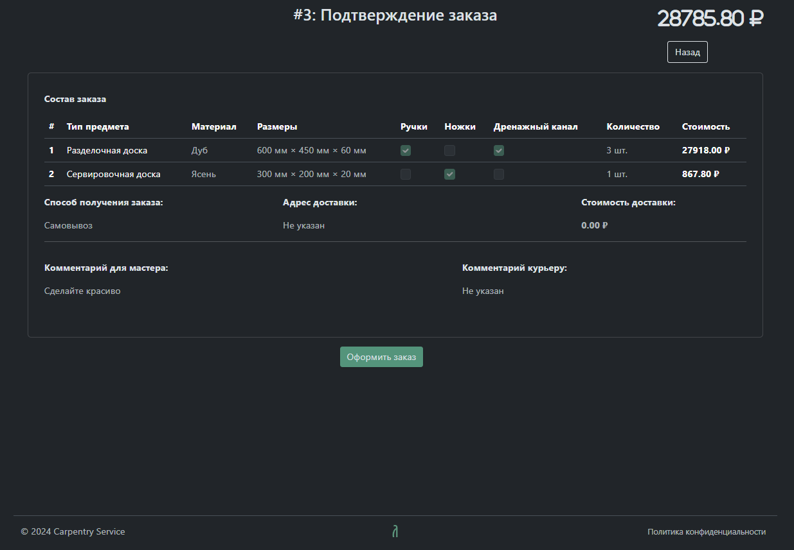

# carpentry-service

[](https://www.python.org)
[](https://www.djangoproject.com)
[](LICENSE)

Full-stack web service for a carpentry workshop. Django backend with user management, product configuration, and order lifecycle tracking.

## Table of Contents

- [Overview](#overview)
- [Features](#features)
- [Tech Stack](#tech-stack)
- [Backend Logic](#backend-logic)
- [User Interface](#user-interface)
- [Application Flow](#application-flow)
  - [Landing Page](#landing-page)
  - [Product Configuration](#product-configuration)
  - [Order Confirmation](#order-confirmation)
  - [Order History](#order-history)
- [Setup](#setup)

## Overview

This project implements a backend-driven web service for configuring and ordering custom woodwork. The core logic — including user management, product configuration, and pricing — is handled server-side using Django.

The frontend is template-based and serves as an interface to the backend, supporting form submissions, dynamic updates via AJAX, and session-based workflows.

## Features

- User registration and authentication
- Interactive product configuration with real-time price updates
- Order creation and history tracking
- Responsive UI with form-based navigation
- Admin interface for order management

## Tech Stack

- **Backend**: Python 3.12+, Django 5.1+
- **Authentication**: Native Django auth (using `django.contrib.auth`)
- **Security**: Django CSRF tokens, session management
- **Frontend**: Template-based HTML, CSS with Bootstrap 5, JavaScript
- **Communication**: AJAX requests to Django views; REST-like endpoints for dynamic updates
- **Management**: Custom Django management commands

## Backend Logic

All business logic is implemented on the server:

- Product configuration and price calculation are performed in Django views.
- Each change in the constructor sends a draft order to the backend, which validates the data and returns the updated price.
- Form submissions are protected with Django CSRF tokens.
- The system uses Django’s built-in authentication and session framework.

The interaction between frontend and backend follows REST-like patterns with clear endpoints handling specific actions.

## User Interface

The frontend is built using Django templates and serves static assets directly. It uses:

- Bootstrap 5 for responsive layout and components
- Minimal JavaScript for AJAX calls to update price and options
- Standard Django form handling with CSRF protection

The UI supports the full user journey: `landing` → `configuration` → `order confirmation` → `history`.

## Application Flow

### Landing Page


### Product Configuration


### Order Confirmation



### Order History


## Setup

1. Clone the repository:
   ```bash
   git clone https://github.com/Averlex/carpentry-service.git
   cd carpentry-service
   ```
2. Create and activate a virtual environment:
   ```bash
   python3 -m venv venv
   source ./venv/bin/activate  # Linux/macOS
   # venv/Scripts/activate     # Windows
   ```
3. Install dependencies:
   ```bash
   pip3 install -r requirements.txt
   ```
4. Apply migrations:
   ```bash
   python3 manage.py migrate
   ```
5. (Optional) Clean and seed the database with test data:
   ```bash
   python3 manage.py clean_db
   python3 manage.py fill_db
   ```
6. Run the development server:
   ```bash
   python3 manage.py runserver
   ```
7. Open `http://localhost:8000` (or whatever Django suggests you)
8. Deactivate the environment when done:
   ```bash
   deactivate
   ```
